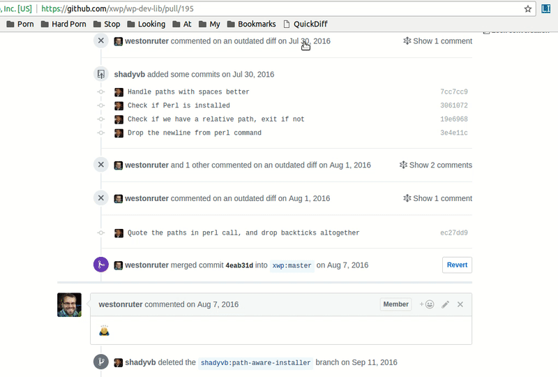

# github-quickdiff
A bookmarklet to quickly generate a diff between two commits.

Github includes a `/compare` view, which makes it possible for developers to view a diff of any two commits. But it's [cumbersome](https://help.github.com/articles/comparing-commits-across-time/) to do so. Would it be better if you could just click the two commits you want to see a diff for?

## Installation

Create a new bookmark in your browser and name it `QuickDiff`. Then insert the contents of [quickdiff.bookmarklet.js](blob/master/quickdiff.bookmarklet.js) as the URL and save the bookmark.
 
## Usage

1. Head to any Github view that lists commits, e.g. a pull request conversation view.
2. Click the `QuickDiff` bookmark. You should see a green prompt to select 2 commits.
3. Select two commits from the list by clicking on them. Pick an older commit first.
4. When you select the second commit, you'll be redirected to the diff view automatically.
5. You can abort the process at any time by pressing the ESC key.

## Contributions

... are welcome if you feel there's something to be contributed. There are no automated tests or standards to adhere to. Just make your changes to `quickdiff.js` and issue a pull request.
